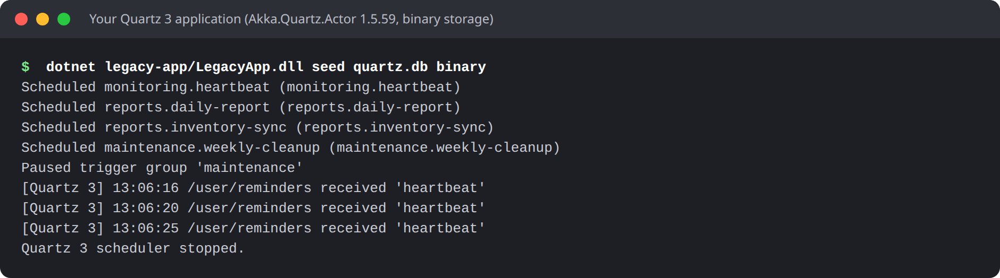
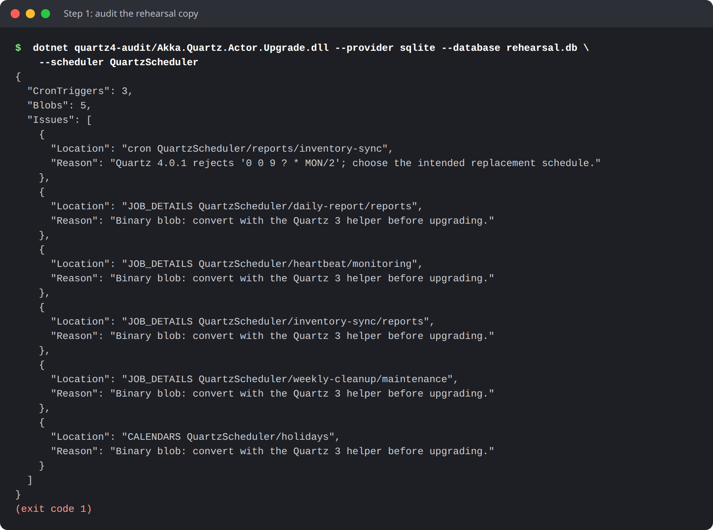
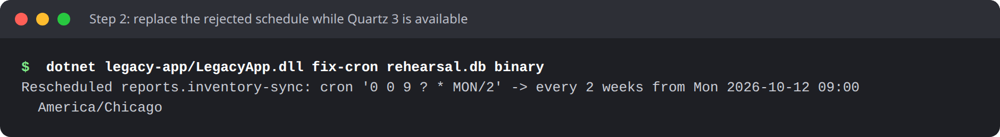
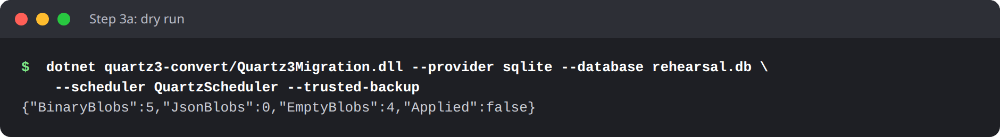
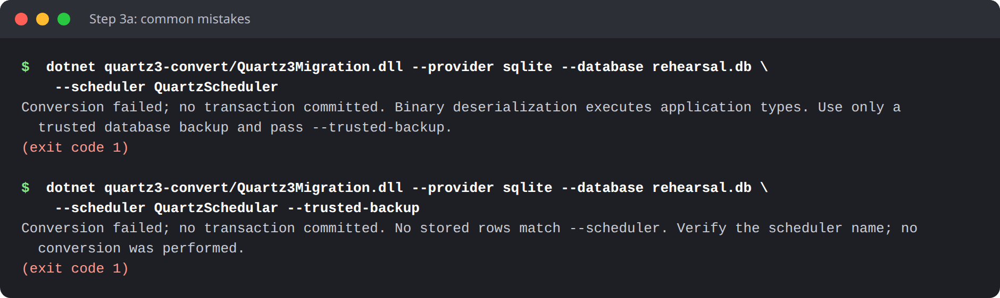
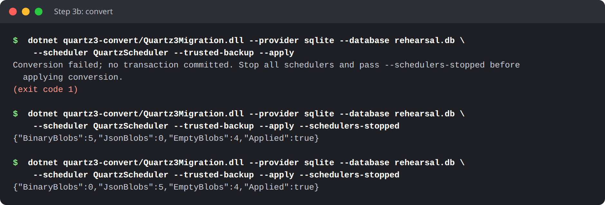
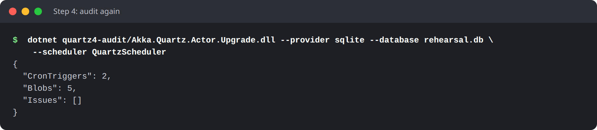
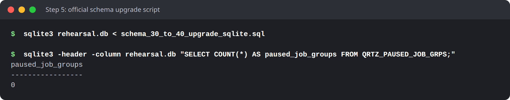
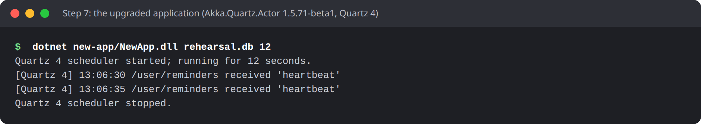

# Upgrading Akka.Quartz.Actor to Quartz 4

Akka.Quartz.Actor **1.5.71-beta2** stays aligned with **Akka.NET 1.5.71** and moves to **Quartz 4.0.1**. Quartz 4.0.1 ships only a .NET 10 build, so Akka.Quartz.Actor, and every application that uses it, must now target **.NET 10**. This is a breaking platform and dependency upgrade despite the package remaining in the 1.5 series. Applications on .NET Framework, .NET Standard, .NET 8 or .NET 9 must stay on **1.5.59** until they can move to .NET 10. Pin the old package explicitly if you cannot migrate yet.

Installing the new package does **not** convert stored data, repair cron expressions or upgrade the database schema. This guide walks through each of those steps.

> **About the screenshots:** they come from a real run of this guide. A sample application on Akka.Quartz.Actor 1.5.59 and Quartz 3.14 stored its jobs in SQLite with the binary serializer; that database was then upgraded with exactly the commands shown, and a 1.5.71-beta2 application picked up the old jobs. To repeat it yourself, see [`examples/upgrade-walkthrough`](https://github.com/akkadotnet/Akka.Quartz.Actor/tree/dev/examples/upgrade-walkthrough).



## Which upgrade path are you on?

Find the Quartz properties your application uses. They are usually in `appsettings.json`, a `quartz.config` file, or the `NameValueCollection` you pass to `QuartzActor`, `QuartzPersistentActor` or `StdSchedulerFactory`. Two settings decide your path:

| `quartz.jobStore.type` | `quartz.serializer.type` | Your path | Steps |
| --- | --- | --- | --- |
| Not set, or `Quartz.Simpl.RAMJobStore, Quartz` | Any | **A: in-memory.** Nothing is stored, so there is no database to migrate. | [6](#step-6-update-the-application) and [7](#step-7-start-up-and-verify) |
| `Quartz.Impl.AdoJobStore.JobStoreTX, Quartz` (or another ADO store) | `json` or `newtonsoft` | **B: database with JSON data.** Your data is already readable by Quartz 4. | All except step 3 |
| ADO store, as above | `binary` | **C: database with binary data.** Quartz 4 cannot read it until you convert it. | All steps |

If you are unsure, run the read-only [audit in step 1](#step-1-audit-the-rehearsal-copy). It lists every row that still holds binary data.

Until Akka.Quartz.Actor 1.5.33 (January 2025), this repository's database integration test, its only database configuration example, used `quartz.serializer.type = binary`. If you copied that configuration, you are on path C.

## Before you start

Rehearse the whole upgrade on a copy of your database before touching production.

1. **Take a full backup** with your database's normal tooling: `BACKUP DATABASE` for SQL Server, `pg_dump` for PostgreSQL, or a copy of the file for SQLite while every scheduler is stopped.
2. **Restore it as a separate rehearsal database.** Run every step below against the rehearsal copy first.
3. **Record the following.** You need them to run the tools, and to confirm afterwards that nothing went missing.

| What to record | Where to find it | Why it matters |
| --- | --- | --- |
| Scheduler instance name | `quartz.scheduler.instanceName`, or the `SCHED_NAME` column (query below) | Passed to the tools as `--scheduler`. If the name changes, saved jobs appear to vanish. |
| Table prefix | `quartz.jobStore.tablePrefix` (default `QRTZ_`) | Passed to the tools as `--prefix`. If the prefix changes, saved jobs appear to vanish. |
| Serializer | `quartz.serializer.type` | Decides your path (above). Keep the same family after the upgrade. |
| Jobs, triggers and next fire times | Queries below | Your baseline for comparing after the cutover. |
| Paused trigger groups | `QRTZ_PAUSED_TRIGGER_GRPS` (query below) | Confirm they are still paused afterwards. Re-pause any job groups you paused through the API. |
| Akka serializer bindings and the actor paths jobs send to | Your HOCON (`akka.actor.serializers`, `serialization-bindings`), your `ActorSystem` name and the receivers you create | Saved jobs store the full actor path (for example `akka://walkthrough/user/reminders`) and Akka-serialized message bytes. Both must still resolve after the upgrade. |
| Package versions and target framework | Your `.csproj` / `Directory.Packages.props` | Needed to roll back. |

Run these queries against the rehearsal copy and save the results. Replace `QRTZ_` with your prefix:

```sql
-- Scheduler names in this store (use one with --scheduler)
SELECT DISTINCT SCHED_NAME FROM QRTZ_TRIGGERS;

-- Baseline: saved triggers, and when each fires next (NEXT_FIRE_TIME is in UTC .NET ticks)
SELECT SCHED_NAME, TRIGGER_GROUP, TRIGGER_NAME, TRIGGER_STATE, NEXT_FIRE_TIME FROM QRTZ_TRIGGERS;
SELECT SCHED_NAME, JOB_GROUP, JOB_NAME FROM QRTZ_JOB_DETAILS;

-- Paused trigger groups
SELECT * FROM QRTZ_PAUSED_TRIGGER_GRPS;

-- Cron schedules (step 1 checks these against Quartz 4)
SELECT TRIGGER_GROUP, TRIGGER_NAME, CRON_EXPRESSION, TIME_ZONE_ID FROM QRTZ_CRON_TRIGGERS;
```

On SQLite you can show `NEXT_FIRE_TIME` as a readable UTC time with `datetime((NEXT_FIRE_TIME - 621355968000000000) / 10000000, 'unixepoch')`. In the walkthrough, the baseline looked like this. Note the `MON/2` cron expression and the paused `maintenance` group:


4. **Decide how overdue jobs should behave.** Triggers that should have fired during the downtime follow each trigger's misfire instruction: catch up, fire once, or skip. Confirm that is what you want on the rehearsal copy. The tools never change fire times or misfire policies.

## Get the upgrade tools

Paths B and C use two command-line tools. Path A does not need them.

- `quartz4-audit` checks your data with the exact Quartz 4.0.1 parser and reader, without changing anything.
- `quartz3-convert` converts binary data to JSON using Quartz 3.14 (path C only).

They never start Quartz, fire jobs or contact actors. Both run on the **.NET 10 runtime**; install it on the machine you migrate from.

**Download them:** `quartz-upgrade-tools.zip` is attached to each [GitHub release](https://github.com/akkadotnet/Akka.Quartz.Actor/releases). Extract it; it contains `quartz3-convert/`, `quartz4-audit/` and this guide.

**Or build them from source:** you need Git and the .NET 10 SDK (see `global.json`). Check out the release tag that matches the package version you are upgrading to:

```shell
git clone https://github.com/akkadotnet/Akka.Quartz.Actor.git
cd Akka.Quartz.Actor
git checkout 1.5.71-beta2
pwsh -File scripts/publishUpgradeTools.ps1   # writes artifacts/upgrade-tools
```

Without PowerShell, publish the two projects directly:

```shell
dotnet publish migration/Quartz3Migration/Quartz3Migration.csproj -c Release -o artifacts/upgrade-tools/quartz3-convert
dotnet publish src/Akka.Quartz.Actor.Upgrade/Akka.Quartz.Actor.Upgrade.csproj -c Release -o artifacts/upgrade-tools/quartz4-audit
```

All commands below run from the extracted archive or `artifacts/upgrade-tools`. Check that the runtime is installed:

```text
$ dotnet quartz3-convert/Quartz3Migration.dll --help
Quartz 3 SQL Server/PostgreSQL/SQLite binary-to-Newtonsoft converter. Dry-run by default.
--provider sqlite|sqlserver|postgres (--database <file> | --connection-string-env <name>) --trusted-backup [--scheduler <name>] [--prefix QRTZ_] [--assembly <application.dll>] [--apply --schedulers-stopped]
```

### Connecting to your database

Both tools support **SQL Server, PostgreSQL and SQLite**. The examples in this guide use SQLite; swap in the options for your database:

| Database | Connection options | Example prefix for the default schema |
| --- | --- | --- |
| SQLite | `--provider sqlite --database rehearsal.db` | `QRTZ_` |
| SQL Server | `--provider sqlserver --connection-string-env QUARTZ_CONNECTION` | `dbo.QRTZ_` |
| PostgreSQL | `--provider postgres --connection-string-env QUARTZ_CONNECTION` | `public.QRTZ_` |

For SQL Server and PostgreSQL, put the connection string in an environment variable and pass the variable's *name*. The tools never print the connection string. For example, in bash:

```shell
export QUARTZ_CONNECTION='Server=db.example.com;Database=Quartz;User Id=...;Password=...;Encrypt=true'
dotnet quartz4-audit/Akka.Quartz.Actor.Upgrade.dll --provider sqlserver --connection-string-env QUARTZ_CONNECTION --prefix dbo.QRTZ_ --scheduler QuartzScheduler
```

Things to know:

- The connection string must point at the existing Quartz database. The tools create no databases or tables.
- `--prefix` may include one unquoted schema name, such as `dbo.QRTZ_`. PostgreSQL lowercases unquoted names, matching the official Quartz scripts. Custom quoted or case-sensitive names need your own adaptation.
- `--scheduler` limits the work to one scheduler, and fails if no rows match, so a typo cannot produce a "successful" empty run. Leave it out only when you mean to cover every scheduler in the tables.
- Audits and dry runs are read-only: SQLite opens the file read-only and PostgreSQL uses read-only transactions. SQL Server audits only run queries; use a read-only login if you want the database to enforce it.

## Step 1: Audit the rehearsal copy

Paths B and C. The audit finds everything Quartz 4 will not accept, before you change anything:



The audit:

- parses every saved cron expression with **Quartz 4.0.1**;
- resolves each trigger's time zone the way Quartz 4 does on this machine;
- reads job and trigger data as Quartz 4's `JobDataMap`, and calendars as Quartz 4 calendars;
- flags remaining binary data and any `QRTZ_BLOB_TRIGGERS` rows.

Each problem names the row it affects. It exits with code **1** if it finds issues or cannot read the store; missing tables are a failure, not a clean result. Reports never print message contents.

What to do with each kind of finding:

| Finding | What to do |
| --- | --- |
| `Quartz 4.0.1 rejects '...'` | [Step 2](#step-2-replace-rejected-cron-expressions-while-quartz-3-is-available) |
| `Binary blob: convert with the Quartz 3 helper before upgrading.` | You are on path C: [step 3](#step-3-convert-binary-data-path-c) |
| `Custom BLOB trigger` | Needs an application-specific migration; the tools will not convert it. |
| `Quartz 4 Newtonsoft cannot read this blob` | Usually a custom type or serializer. Pass the assembly with `--assembly`, or migrate that data yourself while Quartz 3 is available. |
| `Quartz 4 cannot resolve this time zone on this host` | Install the time zone data on the server, or reschedule the trigger with a time zone Quartz 4 can resolve. |

## Step 2: Replace rejected cron expressions while Quartz 3 is available

Paths B and C, only if the audit reported cron findings. Quartz **4.0.1 rejects** day-of-week steps written with day names, such as `MON/2`. The tools never rewrite cron expressions, because only you know the intended schedule, and the obvious rewrite can be wrong.

**First, find out what the expression really does under Quartz 3.** Ask your Quartz 3 application for its next fire times:

```csharp
var cron = new CronExpression("0 0 9 ? * MON/2") { TimeZone = TimeZoneInfo.FindSystemTimeZoneById("America/Chicago") };
var time = DateTimeOffset.UtcNow;
for (var i = 0; i < 6 && cron.GetNextValidTimeAfter(time) is { } next; i++)
    Console.WriteLine(next.ToString("ddd yyyy-MM-dd HH:mm zzz"));
```

For `0 0 9 ? * MON/2`, Quartz 3.14 fires **every other Monday**, not on Monday, Wednesday and Friday as `2/2` or `MON,WED,FRI` would. No cron expression can say "every other week", so the walkthrough replaces it with a calendar-interval trigger: every two weeks, starting at the trigger's current next fire time, in the same time zone. That keeps the exact sequence of dates.

**Then reschedule each affected trigger with your Quartz 3 application**, before the upgrade. The scheduler does not need to be started:

```csharp
var key = new TriggerKey("inventory-sync", "reports");
var existing = (ICronTrigger)await scheduler.GetTrigger(key);
var replacement = TriggerBuilder.Create()
    .WithIdentity(key)
    .ForJob(existing.JobKey)
    .StartAt(existing.GetNextFireTimeUtc().Value) // continue the same sequence
    .WithCalendarIntervalSchedule(s => s
        .WithIntervalInWeeks(2)
        .InTimeZone(existing.TimeZone)
        .PreserveHourOfDayAcrossDaylightSavings(true))
    .Build();
await scheduler.RescheduleJob(key, replacement);
```

If an expression simply needs different syntax for the same schedule, rescheduling with a new `WithCronSchedule(...)` works the same way.



Afterwards, compare the trigger's next fire time with your baseline; it should not change. Also check cron expressions in your configuration, code and custom calendars, because the audit only sees saved schedules. Use Quartz 4.0.1's behavior, not later Quartz documentation, as the reference.

## Step 3: Convert binary data (path C)

Skip this step if your store already uses JSON (path B). A persistent job's legacy `byte[]` message *inside JSON* still works with the new actor and needs no conversion. **A BinaryFormatter-encoded database blob is different: Quartz 4 cannot read it, so it must be converted while you can still run Quartz 3. If you skip this step, Quartz 4 puts the affected triggers into the `ERROR` state and they never fire.**

> **Security:** Only run the converter against a backup made by your own trusted application. Reading binary data can execute code from the stored types, even in a dry run. .NET 9 and later removed BinaryFormatter, so the converter restores it with Microsoft's unsupported `System.Runtime.Serialization.Formatters` compatibility package; use it only for this offline conversion. The converter makes you confirm this with `--trusted-backup`.

### 3a. Dry run on the rehearsal copy



The dry run reads and checks every row but writes nothing (`"Applied":false`):

- `BinaryBlobs`: rows that will be converted.
- `JsonBlobs`: rows already in JSON, left unchanged.
- `EmptyBlobs`: rows with no data, left unchanged. Triggers without their own job data are empty.

If the dry run fails, it prints why and exits with code 1. The two most common mistakes:



| Message | What it means | What to do |
| --- | --- | --- |
| `... Use only a trusted database backup and pass --trusted-backup.` | You left out `--trusted-backup`. | Add it once you have confirmed the backup came from your own application. |
| `No stored rows match --scheduler. ...` | The scheduler name has a typo, or that scheduler has no saved data. | Check the `SELECT DISTINCT SCHED_NAME` result from [Before you start](#before-you-start). |
| `Cannot convert QRTZ_JOB_DETAILS <scheduler>/<job>/<group>. Check the blob format and required application assemblies/custom serializers.` | That row holds something the converter will not convert safely (see below). | Convert that data yourself while Quartz 3 is available, or load the missing assembly with `--assembly`. |

**What the converter handles.** It converts Quartz 3's stored `JobDataMap`s when the keys are strings and the values are null, strings, booleans, integers or byte arrays, which covers Akka.Quartz.Actor's own jobs. It checks every converted value against the original before writing anything.

It also converts Quartz's stock Base, Annual, Cron, Daily, Holiday, Monthly and Weekly calendars, including chains of them, when their settings survive the conversion unchanged. That covers types, exclusions, ranges, cron expressions, descriptions, time zones and DailyCalendar's precision.

**What it refuses.** It stops, and rolls back, rather than risk silently changing your data when it finds:

- dates stored as strings, floating-point values, nested objects or other application objects;
- custom map types, custom key comparers or custom calendar subclasses;
- custom serializers;
- any row in `QRTZ_BLOB_TRIGGERS`.

Those need an application-specific migration while Quartz 3 is still available. If your job data uses your own types, load their assemblies with repeatable `--assembly /path/to/application.dll` (dependencies are loaded from the same folder). Loading an assembly does not make an unsupported value convertible, and does not install its serializer registrations. JSON can also change how integers are boxed (`int` may come back as `long`); rehearse any job that depends on the exact type.

### 3b. Convert

Once the rehearsal succeeds, run the same command with `--apply`, which also requires `--schedulers-stopped`. In production, first:

1. Stop **every** scheduler that uses the store, including other applications sharing its tables. See [Shut down cleanly](#shut-down-cleanly-before-migrating).
2. Take the final backup.



`--schedulers-stopped` is your confirmation; the tool cannot detect running nodes for you. The conversion commits once, after every selected row has been checked, and any error rolls back the whole run. Running it again is safe and changes nothing, as the last command above shows.

Keep the backup until the whole cutover is verified. Do not restart old nodes with the binary serializer against the converted store. If you must run Quartz 3 again before the cutover, switch it to its Newtonsoft serializer and test that on the rehearsal copy first.

## Step 4: Audit again

Paths B and C. Run the same audit as step 1. It must now report no issues and exit with code 0:



A clean audit does not prove that messages will reach your actors, that every job class loads, or that custom serializers are registered; step 7 checks that.

## Step 5: Apply the official database upgrade script

Paths B and C, with every old node still stopped.

1. Download the **`schema_30_to_40_upgrade_<db>.sql`** for your database from the [Quartz 4.0.1 migration scripts](https://github.com/quartznet/quartznet/tree/v4.0.1/database/migrations/4.0). It adds the columns Quartz 4 needs and the `QRTZ_PAUSED_JOB_GRPS` table.
2. If your installation uses a different table prefix, edit the script to match.
3. Run it with your normal database deployment tooling and keep its execution record. The upgrade tools never run schema changes.
4. Check that it applied: selecting from `QRTZ_PAUSED_JOB_GRPS` should succeed.



> **Never** run `tables_<db>.sql` against an existing store. Those are fresh-install scripts: they drop the tables and erase your jobs.

The optional `schema_30_to_40_indexes_<db>.sql` must only run after the last Quartz 3 node has stopped.

## Step 6: Update the application

Every path needs these changes.

**Packages and target framework.**

- Target .NET 10.
- Reference Akka.Quartz.Actor 1.5.71-beta2 and the matching Akka.NET 1.5.71 packages.
- Upgrade every direct Quartz package to 4.0.1 at the same time.
- Replace `Quartz.Serialization.Json` with `Quartz.Serialization.Newtonsoft`.
- Remove the 3.x `Quartz.Extensions.DependencyInjection`, `Quartz.Extensions.Hosting` and `Quartz.Serialization.SystemTextJson` packages; their APIs moved into Quartz itself.

**Configuration (paths B and C).** Keep the scheduler name and table prefix, and set:

```text
quartz.serializer.type = newtonsoft
quartz.jobStore.type = Quartz.Impl.AdoJobStore.LocalTransactionJobStore, Quartz
```

Set `newtonsoft` on path C as well: the converter writes the same JSON format Quartz 3's Newtonsoft serializer does. In Quartz 4, `json` means System.Text.Json, while in Quartz 3 it meant Newtonsoft, so leaving `json` unchanged switches serializer families. Do not switch families as part of this upgrade. `JobStoreTX` is now `LocalTransactionJobStore`, and `JobStoreCMT` is now `AmbientTransactionJobStore`. See the [Quartz 4.0.1 migration guide](https://github.com/quartznet/quartznet/blob/v4.0.1/docs/documentation/quartz-4.x/migration-guide.md) for custom stores and delegates.

**Code that uses Quartz directly** must be rebuilt:

- `IJob.Execute` now returns `ValueTask` and takes a `CancellationToken`.
- `Quartz.Spi` is now `Quartz.Extensibility`, and `Quartz.Simpl` is now `Quartz.Impl`.
- `StdSchedulerFactory` is replaced by `QuartzSchedulerBuilder`.

Scheduler lifecycle and scheduling APIs also changed; follow the compiler errors and the upstream guide.

**Check every `new QuartzPersistentActor("name")`.** Under Quartz 3, that constructor returned an existing scheduler registered under the same name, so it could attach to a persistent scheduler configured elsewhere in the process. Quartz 4 has no such registry: the constructor always creates a new scheduler with the default **in-memory** job store. Jobs are still accepted and reported as created, but they are lost when the process stops. The constructor is now `[Obsolete]`. Pass the job store properties instead, or supply the scheduler. This is the walkthrough's upgraded configuration:

Prior to version 1.5.71 Akka.Quartz.Actor replacing an existing job required sending the `RemoveJob` command followed by  `CreateJob` or `CreatePersistentJob`. `CreateJob` and `CreatePersistentJob` commands now support replacing existing jobs if they exist by specifying  `Options` property of `ScheduleJobOptions` type. The job to be replaced must match on both job and trigger keys.    

```csharp
var properties = new NameValueCollection
{
    [QuartzActor.PropertySchedulerInstanceName] = "QuartzScheduler", // keep the existing name
    ["quartz.jobStore.type"] = "Quartz.Impl.AdoJobStore.LocalTransactionJobStore, Quartz",
    ["quartz.jobStore.useProperties"] = "false",
    ["quartz.jobStore.dataSource"] = "default",
    ["quartz.jobStore.tablePrefix"] = "QRTZ_", // keep the existing prefix
    ["quartz.jobStore.driverDelegateType"] = "Quartz.Impl.AdoJobStore.SQLiteDelegate, Quartz",
    ["quartz.dataSource.default.provider"] = "SQLite-Microsoft",
    ["quartz.dataSource.default.connectionString"] = connectionString,
    ["quartz.serializer.type"] = "newtonsoft"
};
// Saved jobs target akka://walkthrough/user/reminders, so the ActorSystem name and actor path stay the same.
var system = ActorSystem.Create("walkthrough");
system.ActorOf(Props.Create(() => new Reminders()), "reminders");
system.ActorOf(Props.Create(() => new QuartzPersistentActor(properties)), "quartz");
```

For the same reason, two actors given the same instance name no longer share a scheduler. Supply one scheduler to both if they must share it. An actor shuts down schedulers it creates, and leaves a scheduler you supplied to you. When an actor that owns its scheduler restarts, the new incarnation waits until the previous scheduler with the same instance name has shut down, including its running jobs, before creating its own.

**Startup order for a scheduler you supply.** Actor-owned schedulers install the persistent actor's context before they start. If you supply the scheduler yourself, create your receivers and the persistent actor first, wait until the actor is ready, and only then start Quartz. Do not let a hosted service start that scheduler earlier.

```csharp
await using var factory = QuartzSchedulerBuilder.Create().UseProperties(properties).Build();
var scheduler = await factory.GetScheduler(cancellationToken);
var receiver = system.ActorOf(Props.Create(() => new Receiver()), "receiver");
var quartzActor = system.ActorOf(
    Props.Create(() => new QuartzPersistentActor(scheduler)), "quartz");
await quartzActor.Ask<ActorIdentity>(new Identify(null), TimeSpan.FromSeconds(10), cancellationToken);
await scheduler.Start(cancellationToken);
```

Keep Akka serializer IDs and manifests compatible with the saved messages. Existing `OnSchedulerCreated` overrides still run after an actor-owned scheduler starts. When several actors share a scheduler, use one ActorSystem for its persistent jobs.

## Step 7: Start up and verify

Start one node of the upgraded application against the rehearsal copy. In the walkthrough, the heartbeat job saved by the Quartz 3 application is delivered again under Quartz 4:



Then check:

1. **Saved jobs still fire.** Wait for a real scheduled delivery to reach its actor, including after a full process restart. This is the only check that proves messages still deserialize.
2. **Nothing went missing.** Re-run the baseline queries from [Before you start](#before-you-start) and compare the jobs, triggers and next fire times.
3. **Overdue jobs behaved as you decided**, according to their misfire instructions.
4. **Paused groups are still paused.** Re-pause any job groups you had paused through the API; the new `QRTZ_PAUSED_JOB_GRPS` table starts empty.


When the rehearsal passes, repeat the steps on production during the planned downtime.

Do not run old and new versions of Akka.Quartz.Actor against the same store. New jobs store their messages as Base64 strings that the old package cannot read, and the Quartz 4 schema and serializer changes add further incompatibilities.

## Shut down cleanly before migrating

Every scheduler must be fully stopped before step 3b or step 5, not just its actor.

An actor's `Terminated` message does not prove that its scheduler, plugins, jobs or job store have stopped. With Akka's default coordinated shutdown, `await system.Terminate()` waits for every actor-owned scheduler to shut down, including running jobs, in the `before-actor-system-terminate` phase. Set that phase's timeout longer than your slowest job or plugin shutdown, and investigate any timeout or failure before migrating. Disabling coordinated shutdown, recovering from its failures, or letting the phase time out removes this guarantee.

For a strict boundary, use a scheduler you supply and shut it down yourself while the ActorSystem is still running:

```csharp
await scheduler.Shutdown(waitForJobsToComplete: true, cancellationToken);
await factory.DisposeAsync();
await system.Terminate();
```

Do not continue if the shutdown fails or is cancelled. Disposing the factory alone does not wait for running jobs. Repeat this on every node and every other application that shares the store, then take the final backup.

## Rolling back

Once the new version has written jobs or calendars, rolling back only the application is unsafe. To roll back, stop the new deployment and restore the pre-cutover database, application and configuration together. Then reconcile anything created or fired since the backup, including external side effects and possible duplicate deliveries. Neither tool reverses the upgrade or guarantees exactly-once delivery.

## What has been tested

Automated tests run real SQL Server 2022 and PostgreSQL 17 containers with pinned upstream Quartz 3 schemas and Quartz 4 upgrade scripts, then confirm that actors receive their scheduled messages. They cover conversion dry runs and apply, rollback after a bad calendar, unchanged schedule times, re-running the conversion, and invalid cron detection on both databases. SQLite tests cover migrating real Quartz 3 data, the converter's confirmation flags, rollback, scheduler scoping, unchanged schedule columns and message bytes, Quartz 4 reads of converted data, and delivery after conversion. They also cover a typed message after a full restart, an overdue one-shot trigger's fire-now policy, failed database writes, startup ordering and scheduler ownership.

The [walkthrough](https://github.com/akkadotnet/Akka.Quartz.Actor/tree/dev/examples/upgrade-walkthrough) repeats the whole upgrade end to end, starting from a store written by Akka.Quartz.Actor 1.5.59 itself, with either the binary or the JSON serializer.

Other databases, custom serializers, calendars or BLOB triggers, clustered cutovers and individual misfire policies still need your own validation. To run the complete checks from a source checkout on a machine with Docker:

```powershell
dotnet build -c Release
pwsh -File scripts/tests/runTests.Tests.ps1
pwsh -File scripts/runTests.ps1
```
